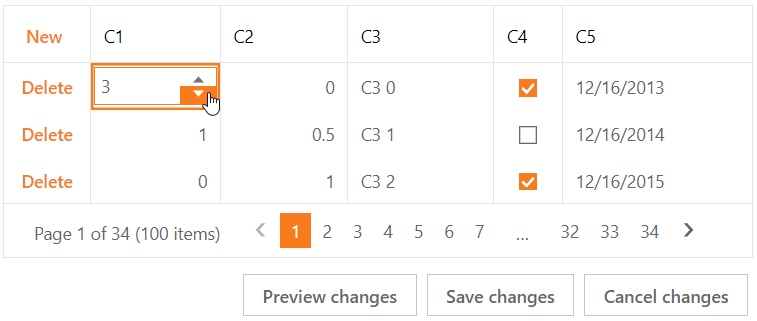

<!-- default badges list -->

[](https://supportcenter.devexpress.com/ticket/details/T115130)
[](https://docs.devexpress.com/GeneralInformation/403183)
<!-- default badges end -->
# Grid View for ASP.NET MVC - How to implement an edit item template in batch mode
<!-- run online -->
**[[Run Online]](https://codecentral.devexpress.com/t115130/)**
<!-- run online end -->

This example demonstrates how to create an edit item template, add an editor to the template, and configure the grid's cell edit functionality in batch mode.



## Overview

Follow the steps below:

1. Call a column's [SetEditItemTemplateContent](https://docs.devexpress.com/AspNetMvc/DevExpress.Web.Mvc.MVCxGridViewColumn.SetEditItemTemplateContent(System.Action-DevExpress.Web.GridViewEditItemTemplateContainer-)?) method and add an editor to the template.

    ```csharp
    settings.Columns.Add(column => {
        column.FieldName = "C1";
        column.SetEditItemTemplateContent(c => {
            @Html.DevExpress().SpinEdit(spinSettings => {
                spinSettings.Name = "C1spinEdit";
                // ...
            }).Render();
        });
    });
    ```

2. Handle the grid's client-side [BatchEditStartEditing](https://docs.devexpress.devx/AspNet/js-ASPxClientGridView.BatchEditStartEditing) event and do the following in the handler:

   * Use the [rowValues](https://docs.devexpress.devx/AspNet/js-ASPxClientGridViewBatchEditStartEditingEventArgs.rowValues) argument property to get the value of the processed cell.
   * Call the editor's `SetValue` method to assign the cell value to the editor.
   * Focus the editor.

    ```js
    function Grid_BatchEditStartEditing(s, e) {
        var templateColumn = s.GetColumnByField("C1");
        if (!e.rowValues.hasOwnProperty(templateColumn.index))
            return;
        var cellInfo = e.rowValues[templateColumn.index];
        C1spinEdit.SetValue(cellInfo.value);
        if (e.focusedColumn === templateColumn)
            C1spinEdit.Focus();
    }
    ```

3. Handle the grid's client-side [BatchEditEndEditing](https://docs.devexpress.devx/AspNet/js-ASPxClientGridView.BatchEditEndEditing) event. In the handler, get the editor's value and use the [rowValues](https://docs.devexpress.devx/AspNet/js-ASPxClientGridViewBatchEditEndEditingEventArgs.rowValues) argument property to assign this value to the processed cell.

    ```js
    function Grid_BatchEditEndEditing(s, e) {
        var templateColumn = s.GetColumnByField("C1");
        if (!e.rowValues.hasOwnProperty(templateColumn.index))
            return;
        var cellInfo = e.rowValues[templateColumn.index];
        cellInfo.value = C1spinEdit.GetValue();
        cellInfo.text = C1spinEdit.GetText();
        C1spinEdit.SetValue(null);
    }
    ```

4. Handle the grid's client-side [BatchEditRowValidating](https://docs.devexpress.devx/AspNet/js-ASPxClientGridView.BatchEditRowValidating) event. In the handler, use the [validationInfo](https://docs.devexpress.devx/AspNet/js-ASPxClientGridViewBatchEditRowValidatingEventArgs.validationInfo) argument property to define whether the entered data is valid and specify an error text string for invalid data cells.

    ```js
    function Grid_BatchEditRowValidating(s, e) {
        var templateColumn = s.GetColumnByField("C1");
        var cellValidationInfo = e.validationInfo[templateColumn.index];
        if (!cellValidationInfo) return;
        var value = cellValidationInfo.value;
        if (!ASPxClientUtils.IsExists(value) || ASPxClientUtils.Trim(value) === "") {
            cellValidationInfo.isValid = false;
            cellValidationInfo.errorText = "C1 is required";
        }
    }
    ```

5. Handle the editor's client-side `KeyDown` and `LostFocus` events to emulate the editor behavior when a user presses a key or clicks outside the editor.

## Files to Review

* [_GridViewPartial.cshtml](./CS/GridViewBatchEdit/Views/Home/_GridViewPartial.cshtml)
* [Index.cshtml](./CS/GridViewBatchEdit/Views/Home/Index.cshtml)

## Documentation


* [Batch Edit Mode](https://docs.devexpress.com/AspNetMvc/16147/components/grid-view/concepts/data-editing-and-validation/batch-edit)
* [SetEditItemTemplateContent](https://docs.devexpress.com/AspNetMvc/DevExpress.Web.Mvc.MVCxGridViewColumn.SetEditItemTemplateContent.overloads)

## More Examples

* [Grid View for ASP.NET Web Forms - How to implement an edit item template in batch mode](https://github.com/DevExpress-Examples/aspxgridview-batch-editing-a-simple-implementation-of-an-edititemtemplate-t115096)
